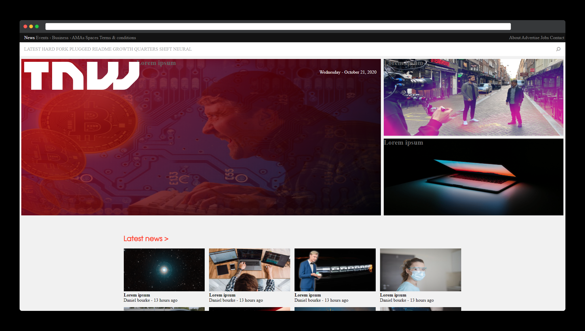
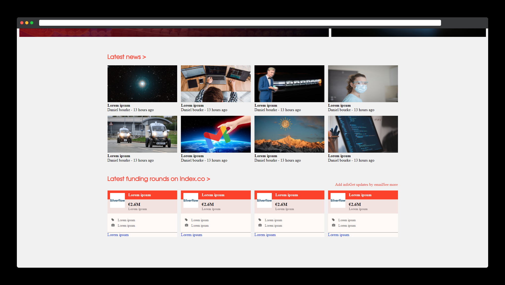

# BUILDING WITH RESPONSIVE DESIGN

> This project consists of replicating the The Next Web website putting emphasis on how it behaves differently depending on the size of the screen where the website is rendered.

I created this project using some images and buttons tags, also we used flex boxes, floats and grid systems for positioning.

## Built With

- HTML.
- CSS.
- CSS Media Queries.
- VS Code.
- Git/GitHub.

## Live Demo

[Live Demo Link](https://carloso0114.github.io/Building-with-Responsive-Design/.)

## How to run it

To get a local copy up and running follow these simple steps.

* If you're using latest version of git.

* Clone this url https://github.com/carloso0114/Building-with-Responsive-Design/tree/the-next-web on your local host.

* You have to use a Web explorer browser like Google Chrome or Mozilla Firefox to open the index.html file.

## Authors

👤 **carloso0114**

- GitHub: [Carloso0114](https://github.com/carloso0114)
- Twitter: [Carlos_Osp1](https://twitter.com/Carlos_Osp1)
- LinkedIn: [Carlos Ospina](https://www.linkedin.com/in/carlos-ospina-242b831a6/)

## Show your support

Give a ⭐️ if you like this project!
